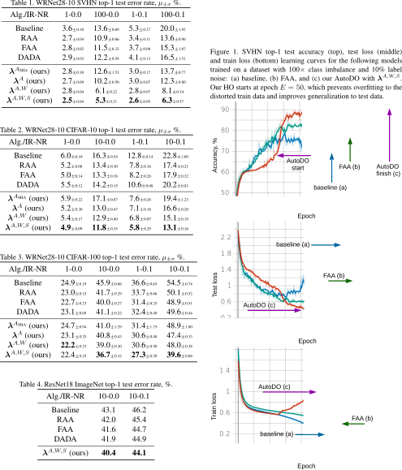

# AutoDO: Robust AutoAugment for Biased Data with Label Noise via Scalable Probabilistic Implicit Differentiation
[https://arxiv.org/abs/???](https://arxiv.org/abs/???)

## Abstract
Active learning (AL) aims to minimize labeling efforts for data-demanding deep neural networks (DNNs) by selecting the most representative data points for annotation. However, currently used methods are ill-equipped to deal with biased data. The main motivation of this paper is to consider a realistic setting for pool-based semi-supervised AL, where the unlabeled collection of train data is biased. We theoretically derive an optimal acquisition function for AL in this setting. It can be formulated as distribution shift minimization between unlabeled train data and weakly-labeled validation dataset. To implement such acquisition function, we propose a low-complexity method for feature density matching using Fisher kernel (FK) self-supervision as well as several novel pseudo-label estimators. Our FK-based method outperforms state-of-the-art methods on MNIST, SVHN, and ImageNet classification while requiring only 1/10th of processing. The conducted experiments show at least 40% drop in labeling efforts for the biased class-imbalanced data compared to existing methods.

## BibTex Citation
If you like our [paper](https://arxiv.org/abs/???) or code, please cite its CVPR2021 preprint using the following BibTex:
```
@article{gudovskiy2021autodo,
  title={AutoDO: Robust AutoAugment for Biased Data with Label Noise via Scalable Probabilistic Implicit Differentiation},
  author={Gudovskiy, Denis and Rigazio, Luca and Ishizaka, Shun and Kozuka, Kazuki and Tsukizawa, Sotaro},
  journal={arXiv:???},
  year={2021}
}
```

## Installation
- Clone this repository: tested on Python 3.6
- Install [PyTorch](http://pytorch.org/): tested on v1.6
- Install [Kornia](https://github.com/arraiyopensource/kornia): tested on v0.4.1
- Other dependencies in requirements.txt

## Datasets
Model checkpoints, datasets and index files for distorted train data are saved by default into ./local_data/{dataset} folder. For example, MNIST data is saved into ./local_data/MNIST folder. In order to get statistically significant results, we execute multiple runs of the same configuration with randomized weights and training dataset splits and save results to ./local_data/{dataset}/runN/ folders. We suggest to check that you have enough disk space for large-scale datasets.

### MNIST, SVHN, SVHN_extra, CIFAR-10, CIFAR-100
Datasets will be automatically downloaded

### ImageNet
Due to large size, ImageNet has to be manually downloaded according to [torchvision instructions](https://pytorch.org/docs/stable/_modules/torchvision/datasets/imagenet.html#ImageNet).

## Code Organization
- ./custom_datasets - contains dataloaders (copied from torchvision)
- ./custom_models - contains CNN architectures and *AutoDO models and hyperparameter optimization function in automodels.py*
- ./custom_transforms - contains policy models for RandAugment, Fast AutoAugment and DADA methods as well as common image preprocessing functions

## Running Experiments
- Install minimal required packages using requirements.txt
- Run code with the config by selecting IR, NR, dataset and runN
- The sequence below should reproduce SVHN reference results for run0:

```Shell
python3 -m pip install -U -r requirements.txt
python3 implicit-augment.py -r run0 --gpu 0 -nr 0.1 -ir 100 --dataset SVHN --aug-model NONE
python3 implicit-augment.py -r run0 --gpu 0 -nr 0.1 -ir 100 --dataset SVHN --aug-model RAND
python3 implicit-augment.py -r run0 --gpu 0 -nr 0.1 -ir 100 --dataset SVHN --aug-model AUTO
python3 implicit-augment.py -r run0 --gpu 0 -nr 0.1 -ir 100 --dataset SVHN --aug-model DADA
python3 implicit-augment.py -r run0 --gpu 0 -nr 0.1 -ir 100 --dataset SVHN --aug-model SHA --los-model NONE --hyper-opt HES
python3 implicit-augment.py -r run0 --gpu 0 -nr 0.1 -ir 100 --dataset SVHN --aug-model SEP --los-model NONE --hyper-opt HES
python3 implicit-augment.py -r run0 --gpu 0 -nr 0.1 -ir 100 --dataset SVHN --aug-model SEP --los-model WGHT --hyper-opt HES
python3 implicit-augment.py -r run0 --gpu 0 -nr 0.1 -ir 100 --dataset SVHN --aug-model SEP --los-model BOTH --hyper-opt HES
```

- After finishing all N runs, we calculate [mu/std] results using the following script:

```Shell
python3 get-results.py -nr 0.1 -ir 100 --dataset SVHN --aug-model NONE
python3 get-results.py -nr 0.1 -ir 100 --dataset SVHN --aug-model RAND
python3 get-results.py -nr 0.1 -ir 100 --dataset SVHN --aug-model AUTO
python3 get-results.py -nr 0.1 -ir 100 --dataset SVHN --aug-model DADA
python3 get-results.py -nr 0.1 -ir 100 --dataset SVHN --aug-model SHA --los-model NONE --hyper-opt HES
python3 get-results.py -nr 0.1 -ir 100 --dataset SVHN --aug-model SEP --los-model NONE --hyper-opt HES
python3 get-results.py -nr 0.1 -ir 100 --dataset SVHN --aug-model SEP --los-model WGHT --hyper-opt HES
python3 get-results.py -nr 0.1 -ir 100 --dataset SVHN --aug-model SEP --los-model BOTH --hyper-opt HES
```

- Ablations studies are performed using "--overfit/oversplit" arguments
- Learning curves are logged by tensorboard inside implicit-augment.py script
- Qualitative Figures are generates using visualize-density.py script

## Reference Results

